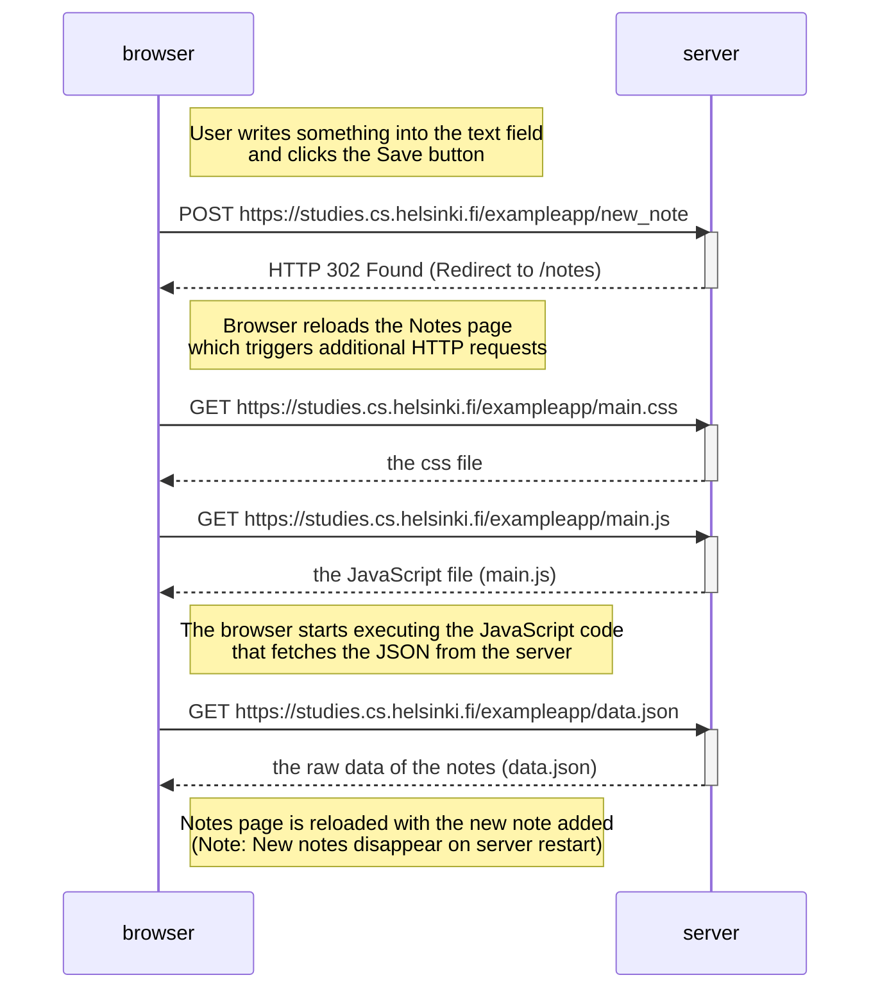

Sequence of Events in Traditional Notes App: Adding a New Note

```mermaid

sequenceDiagram
    participant browser
    participant server

    Note right of browser: User writes something into the text field<br>and clicks the Save button

    browser->>server: POST https://studies.cs.helsinki.fi/exampleapp/new_note
    activate server
    server-->>browser: HTTP 302 Found (Redirect to /notes)
    deactivate server

    Note right of browser: Browser reloads the Notes page<br>which triggers additional HTTP requests

    browser->>server: GET https://studies.cs.helsinki.fi/exampleapp/main.css
    activate server
    server-->>browser: the css file
    deactivate server

    browser->>server: GET https://studies.cs.helsinki.fi/exampleapp/main.js
    activate server
    server-->>browser: the JavaScript file (main.js)
    deactivate server

    Note right of browser: The browser starts executing the JavaScript code <br> that fetches the JSON from the server

    browser->>server: GET https://studies.cs.helsinki.fi/exampleapp/data.json
    activate server
    server-->>browser: the raw data of the notes (data.json)
    deactivate server

    Note right of browser: Notes page is reloaded with the new note added<br>(Note: New notes disappear on server restart)

```
