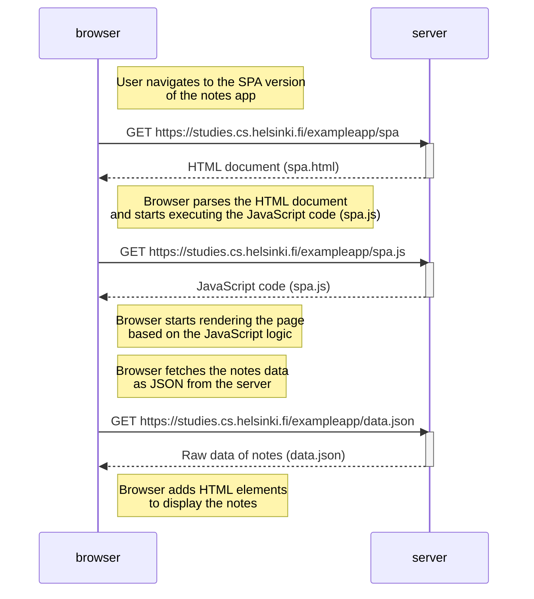

Initial Page Load in Single-Page App Version of Notes App

```mermaid

sequenceDiagram
    participant browser
    participant server

    Note right of browser: User navigates to the SPA version<br>of the notes app

    browser->>server: GET https://studies.cs.helsinki.fi/exampleapp/spa
    activate server
    server-->>browser: HTML document (spa.html)
    deactivate server

    Note right of browser: Browser parses the HTML document<br>and starts executing the JavaScript code (spa.js)

    browser->>server: GET https://studies.cs.helsinki.fi/exampleapp/spa.js
    activate server
    server-->>browser: JavaScript code (spa.js)
    deactivate server

    Note right of browser: Browser starts rendering the page<br>based on the JavaScript logic

    Note right of browser: Browser fetches the notes data<br>as JSON from the server

    browser->>server: GET https://studies.cs.helsinki.fi/exampleapp/data.json
    activate server
    server-->>browser: Raw data of notes (data.json)
    deactivate server

    Note right of browser: Browser adds HTML elements<br>to display the notes

```
