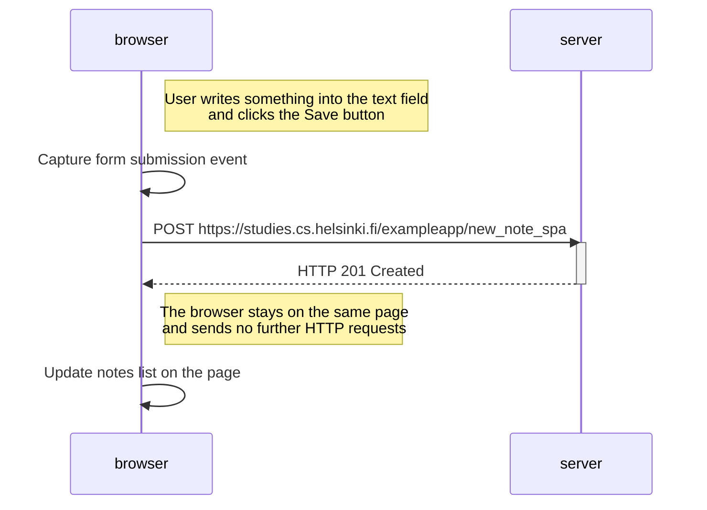

Sequence of Events in Single-Page App: Adding a New Note

```mermaid

sequenceDiagram
    participant browser
    participant server

    Note right of browser: User writes something into the text field<br>and clicks the Save button

    browser->>browser: Capture form submission event
    browser->>server: POST https://studies.cs.helsinki.fi/exampleapp/new_note_spa
    activate server
    server-->>browser: HTTP 201 Created
    deactivate server

    Note right of browser: The browser stays on the same page<br>and sends no further HTTP requests

    browser->>browser: Update notes list on the page

```
